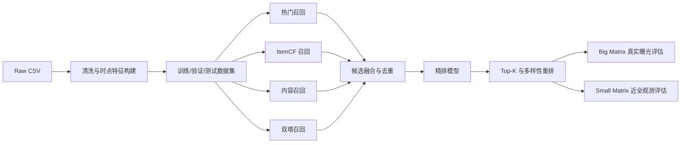

# KuaiRec 多路召回与精排工程设计

## 1. 文档目标

本文设计一个可复现、可消融、贴合 KuaiRec 真实数据约束的两阶段推荐系统。项目目标不是堆叠复杂模型，而是通过统一数据协议和严格消融实验，确定：

1. 最可靠的召回 baseline；
2. 最可靠的精排 baseline；
3. 每一类特征、召回通道和损失设计的真实增益；
4. 模型在真实曝光分布与近全观测分布上的差异。

最终系统应支持离线训练、批量召回、精排、统一评估、实验追踪和可选在线服务演示。

## 2. 真实数据约束

### 2.1 已验证的数据事实

| 事实 | 实际数据 | 工程影响 |
|---|---:|---|
| 大矩阵交互 | 12,530,806 | 可训练真实曝光分布下的召回与排序模型 |
| 小矩阵交互 | 4,676,570 | 可进行近全观测偏置诊断 |
| 大矩阵密度 | 16.28% | 未曝光物品不能直接当作真实负反馈 |
| 小矩阵密度 | 99.62% | 可更可靠地评价用户对物品的真实偏好 |
| 大矩阵 Top 20% 视频交互占比 | 66.39% | 热门偏置显著，必须报告覆盖率和流行度偏置 |
| 大矩阵测试期新视频比例 | 47.95% | 必须单独评价冷启动召回 |
| 小矩阵测试期新视频比例 | 3.32% | 适合评价已知物品偏好 |
| 两张矩阵用户-视频对交集 | 0 | 小矩阵不存在目标 pair 泄漏，可作为独立诊断集 |
| `watch_ratio >= 1` | 大矩阵 33.82% | 适合作为主排序标签 |
| `watch_ratio >= 2` | 大矩阵 7.47% | 适合作为高价值稀疏目标 |
| `watch_ratio` 最大值 | 573.46 | 连续标签必须截断或变换 |
| 社交网络覆盖用户 | 472 / 7,176 | 社交召回只能作为覆盖有限的附加通道 |
| 视频日统计 | 343,341 行 | 可构造热度和质量特征，但必须严格滞后 |

### 2.2 数据不具备的信息

KuaiRec 不提供请求 ID、曝光位置、原始候选集和点击行为。因此：

- 不能声称实现了严格的位置偏置校正；
- 不能将未曝光物品直接标为负样本后宣称得到无偏 CTR；
- 不能完全复原线上每次请求的候选排序；
- 排序训练应优先使用已有曝光记录的播放反馈；
- 端到端 Top-K 结果必须同时在大矩阵和小矩阵报告，明确偏置差异。

## 3. 系统范围与成功标准

### 3.1 系统范围



### 3.2 成功标准

baseline 不是单纯取得最高单项指标的模型。召回与精排冠军均需满足：

- 主指标相对当前冠军有稳定提升；
- 用户级 paired bootstrap 95% 置信区间不跨 0；
- 不显著损害覆盖率、冷启动效果和长尾效果；
- 训练与推理成本适合单机复现；
- 所有输入特征在预测时点可获得；
- 至少复跑 3 次，神经模型与采样模型报告均值和标准差。

## 4. 项目目录设计

```text
kuairec/
├── configs/
│   └── experiments.yaml
├── data/
│   ├── raw/                 # 官方数据，不提交 Git
│   ├── interim/             # 清洗、映射、时点聚合结果
│   └── processed/           # 训练、验证、测试和候选集
├── docs/
│   └── ENGINEERING_DESIGN.md
├── artifacts/
│   ├── recall/              # 相似度矩阵、向量索引、召回结果
│   ├── ranking/             # 排序模型
│   └── metrics/             # 每次实验的指标与预测
├── src/
│   ├── data/                # 清洗、切分、特征构建
│   ├── recall/              # 各召回通道
│   ├── ranking/             # 精排模型
│   ├── evaluation/          # 统一评估器
│   └── pipeline/            # 训练与端到端流水线
└── tests/                   # 泄漏、切分、指标与特征单测
```

每个实验必须保存配置快照、Git commit、随机种子、数据版本、模型文件、逐用户指标和汇总指标。

## 5. 数据协议

### 5.1 时间切分

固定主切分，不允许为模型单独调整：

| 数据集 | 日期 | 大矩阵实际交互数 |
|---|---|---:|
| Train | 2020-07-05 至 2020-08-10（日志实际有两个日期块） | 9,199,872 |
| Validation | 2020-08-27 至 2020-08-31 | 2,192,739 |
| Test | 2020-09-01 至 2020-09-05 | 1,138,195 |

小矩阵同样按日期切分：

| 数据集 | 实际交互数 |
|---|---:|
| Train | 4,251,394 |
| Validation | 189,952 |
| Test | 235,224 |

主实验只用 `big_matrix` 训练。`small_matrix` 不参与模型拟合和超参数选择，只用于最终偏置诊断，防止把无偏测试集调成另一个验证集。

开发阶段所有冠军选择只看大矩阵 Validation。大矩阵 Test 和小矩阵均在模型、特征和超参数冻结后运行；如果最终审计暴露问题，应登记下一轮预设实验，而不是回头反复调当前结果。

### 5.2 标签定义

主标签：

```text
y_complete = 1[watch_ratio >= 1]
```

辅助标签：

```text
y_strong = 1[watch_ratio >= 2]
y_short = 1[play_duration < min(3000, video_duration)]
y_watch = log1p(min(watch_ratio, 5))
```

排序主效用分数用于离线 Top-K 评价：

```text
utility = 1.0 * y_complete + 0.5 * y_strong - 0.5 * y_short
```

`utility` 仅作为项目统一离线口径，不声称等价于真实业务价值；必须同时报告各单目标指标。

### 5.3 样本与去重

- 大矩阵同一用户-视频 pair 存在重复交互，训练时保留，以反映重复消费。
- 召回评估 Ground Truth 按用户对正反馈视频去重。
- 排序评估保留每条曝光，避免丢失重复播放信号。
- 历史序列按 `timestamp` 排序，任何特征只能读取当前样本之前的行为。
- 视频原始类目表先删除 55 条完全重复行，再做多标签聚合。

### 5.4 可用物品集合

日期 `D` 的候选目录定义为：

```text
eligible_items(D) = item_first_seen_date <= D
```

其中 `item_first_seen_date` 来自 `item_daily_features` 最早日期。`visible_status` 作为特征和诊断字段，不直接静默过滤；如果过滤导致真实正样本被删除，必须报告正样本保留率。

### 5.5 防泄漏要求

- 日期 `D` 的日统计特征只能使用 `D-1` 及更早数据；
- 用户历史特征只使用当前交互时间戳之前的数据；
- 验证与测试候选目录不得包含其日期之后才出现的视频；
- 全局编码器、归一化器和低频阈值仅在训练集拟合；
- 小矩阵不得参与调参；
- 必须实现自动化泄漏测试。

## 6. 评估协议

### 6.1 三个评估面板

| 面板 | 数据 | 目的 | 局限 |
|---|---|---|---|
| A. Logged Ranking | 大矩阵验证/测试曝光 | 评价精排对真实曝光的区分能力 | 受曝光策略偏置影响 |
| B. Temporal End-to-End | 大矩阵时间测试集 | 评价召回 + 精排的时序表现 | 未曝光物品反馈未知 |
| C. Near-Fully-Observed | 小矩阵测试集与完整矩阵诊断 | 检验流行度偏置与泛化 | 与线上曝光机制不同 |

面板 C 分两种口径：

- `small_temporal`：只评价小矩阵测试日期中的反馈，作为严格时间诊断；
- `small_test`：模型冻结后，在小矩阵测试日期反馈上做独立偏置诊断。缺少日期的交互不进入时间面板。

时间面板采用用户-天滚动评价。对每个日期 `D`：

1. 只使用 `D` 之前的用户历史和物品统计；
2. 从 `eligible_items(D)` 中召回；
3. 使用用户在日期 `D` 的正反馈视频作为 Ground Truth；
4. 计算用户-天指标，再先按用户、后按全体用户聚合。

数据没有 request ID，Logged Ranking 使用“用户-天”作为近似排序组；文档和结果中必须明确这是离线代理组，而不是真实线上请求。

### 6.2 召回评价

Ground Truth 默认使用测试期 `y_complete=1` 的去重视频集合，同时额外报告 `y_strong=1`。

每个用户从预测时点可用目录召回 Top-K，排除训练期已消费视频。报告：

- `Recall@20/50/100/200`
- `HitRate@20/50/100`
- `NDCG@20/50/100`
- `CatalogCoverage@K`
- `LongTailCoverage@K`
- `AveragePopularity@K`
- `ColdItemRecall@K`
- 平均候选数、P95 召回耗时

冷启动视频定义为训练期无交互、但验证或测试期出现的视频。鉴于大矩阵测试期约 47.95% 视频为训练期新视频，`ColdItemRecall@K` 是强制指标。

### 6.3 精排评价

当前可运行 baseline 的精排消融使用相同的 Logged Exposure 用户-天候选组，确保各精排模型面对完全一致的样本。由于大矩阵不提供未曝光候选的真实反馈，不能在大矩阵上把召回候选直接当作有标签精排候选。

排序报告：

- 曝光级 `AUC`、`LogLoss`
- 用户加权 `GAUC`
- Logged Exposure 用户-天组上的 `NDCG@10`
- 完播、强兴趣、短播三个任务的独立指标
- 分群指标：活跃度、热门/长尾物品、已知/冷启动物品
- 平均推理耗时与模型大小

### 6.4 统计显著性

- 按用户计算指标差值；
- 使用 1,000 次 paired bootstrap；
- 报告平均差值与 95% CI；
- 神经模型和带采样模型使用 3 个随机种子；
- 只有主指标提升且 CI 不跨 0，才可称为有效提升。

## 7. 召回工程设计

### 7.1 统一接口

所有召回通道实现同一接口：

```python
fit(train_interactions, item_features, user_features)
retrieve(user_id, as_of_time, k) -> list[Candidate]
```

每个 `Candidate` 至少包含：

```text
user_id, video_id, channel, raw_score, channel_rank, as_of_time
```

融合后增加每个通道的 score/rank、命中通道数、最大/平均归一化分数，供精排使用。

### 7.2 召回 baseline 阶梯

#### R0：时间衰减热门召回

作为最低可用 baseline：

```text
score(item, D) = Σ interaction_weight * exp(-lambda * age_days)
```

仅使用 `D-1` 之前交互。对全局热门、类目热门和新视频热门分别保留候选配额。

消融：

| ID | 改动 | 验证问题 |
|---|---|---|
| R0.0 | 全局累计热门 | 最朴素下界 |
| R0.1 | 7 日窗口 | 短期热度是否更有效 |
| R0.2 | 指数时间衰减 | 连续衰减是否优于固定窗口 |
| R0.3 | 加入类目热门配额 | 是否改善个性化和覆盖率 |
| R0.4 | 加入新视频探索配额 | 是否改善冷启动召回 |

#### R1：ItemCF baseline

以用户正反馈历史构建物品共现：

```text
sim(i, j) = Σ_u w_ui * w_uj / log(1 + |I_u|)
```

用户历史召回分数：

```text
score(u, j) = Σ_i∈history(u) sim(i, j) * time_decay(i)
```

消融：

| ID | 改动 | 验证问题 |
|---|---|---|
| R1.0 | 二值完播 + cosine | 标准 ItemCF |
| R1.1 | 去掉 IUF 用户活跃惩罚 | 活跃用户是否放大共现噪声 |
| R1.2 | 加入交互时间衰减 | 短期兴趣是否更重要 |
| R1.3 | `complete + strong - short` 加权 | 多反馈权重是否优于二值反馈 |
| R1.4 | 热门惩罚/BM25 相似度 | 是否降低热门挤压 |
| R1.5 | 历史长度 20/50/100 | 长短期历史的最佳范围 |

#### R2：内容召回 baseline

内容召回承担训练期新视频问题。对用户历史正反馈视频向量做时间加权平均，再检索相似视频。

消融：

| ID | Item 表示 | 验证问题 |
|---|---|---|
| R2.0 | 一级类目多热 | 最低成本内容 baseline |
| R2.1 | 三级层级类目 + 标签 | 层级语义是否有效 |
| R2.2 | 类目置信度 `prob` 加权 | 原始类目置信度是否有效 |
| R2.3 | 标题/话题 TF-IDF | 文本是否补充类目语义 |
| R2.4 | 类目 + TF-IDF 融合 | 结构化与文本融合效果 |

内容召回主看 `ColdItemRecall@K`，不能只看总体 Recall。

#### R3：双塔召回

User Tower：

- 用户 ID 和画像 Embedding；
- 最近 20/50 个完播视频与类目池化；
- 活跃度、注册天数、设备和地域。

Item Tower：

- 视频 ID、作者 ID、类目和标签 Embedding；
- 时长、上传类型；
- 可选 TF-IDF/SVD 文本向量。

训练使用正反馈交互和 in-batch negatives。必须做流行度修正或混合负采样，避免只学热门。

消融：

| ID | 改动 | 验证问题 |
|---|---|---|
| R3.0 | ID-only 双塔 | 神经召回下界 |
| R3.1 | + 用户画像 | 用户侧信息增益 |
| R3.2 | + 用户历史序列池化 | 行为兴趣增益 |
| R3.3 | + Item 类目/文本 | 冷启动内容增益 |
| R3.4 | 随机负采样 vs 流行度负采样 | 负采样偏置影响 |
| R3.5 | 二值正样本 vs 多反馈加权 | 标签权重影响 |

#### R4：社交召回

只对有好友信息的 472 名用户实验。召回好友近期完播视频，结果必须同时报告：

- 覆盖用户子集上的 Recall；
- 全体用户 Recall；
- 实际通道覆盖率。

社交通道覆盖太低，不作为主 baseline 冠军候选，只作为多路召回附加实验。

### 7.3 多路融合消融

先对各通道分数做按通道 rank normalization，再融合：

```text
fusion_score = Σ channel_weight * normalized_channel_score
```

融合实验：

| ID | 通道组合 |
|---|---|
| RF0 | 最佳单通道 |
| RF1 | Popular + ItemCF |
| RF2 | Popular + ItemCF + Content |
| RF3 | Popular + ItemCF + Content + TwoTower |
| RF4 | RF3 去掉 Popular |
| RF5 | RF3 去掉 ItemCF |
| RF6 | RF3 去掉 Content |
| RF7 | RF3 去掉 TwoTower |
| RF8 | RF3 + 每通道配额 + 新视频保底 |

每次只改变一个因素。融合权重仅在大矩阵 Validation 上搜索，小矩阵不得参与搜索。

### 7.4 召回冠军选择规则

主指标：大矩阵 Validation 的 `big_temporal Recall@100`。

硬性守门指标：

- `ColdItemRecall@100` 不下降；
- `CatalogCoverage@100` 不下降超过 5%；
- P95 单用户召回耗时满足设定预算。

若多个方案主指标差异无统计显著性，选择更简单、覆盖更高、推理更快的方案作为最佳 baseline。

冠军冻结后才运行大矩阵 Test、小矩阵 Temporal 和 Full Diagnostic。小矩阵结果作为泛化审计，不用于回调本轮参数。

## 8. 精排工程设计

### 8.1 训练数据

主精排训练集使用大矩阵已曝光记录，不把任意未曝光视频直接作为普通负样本：

- 正样本：`y_complete=1`；
- 负样本：已曝光但未完播记录；
- 强兴趣与短播作为辅助目标；
- 训练期内部按时间构造特征；
- 对多数类负样本可降采样，但验证/测试不降采样，预测概率需校准。

端到端候选精排时，未曝光候选没有可靠标签。它们可用于推理，但不作为普通监督负样本参与主 baseline 训练。

### 8.2 特征分组

| 组 | 特征 |
|---|---|
| F0 基础上下文 | 小时、星期、视频时长、用户/视频 ID |
| F1 用户画像 | 活跃度、年龄、设备、地域、注册天数、关注/粉丝数 |
| F2 Item 内容 | 作者、类目、标签、标题 TF-IDF/SVD、上传类型 |
| F3 用户历史统计 | 历史完播率、短播率、近期活跃度、最近交互时间差 |
| F4 序列交叉 | 最近类目/作者匹配、重复曝光、兴趣相似度 |
| F5 滞后 Item 统计 | D-1 以前的热度、完播率、点赞率、趋势 |
| F6 召回通道 | 各通道 score/rank、命中通道数；当前 baseline 尚未启用 |

F5 中所有比例使用贝叶斯平滑，所有日统计必须左移至少一天。

### 8.3 精排 baseline 阶梯

#### P0：Logistic Regression

使用 F0 和少量低基数类别特征，作为可解释下界和数据管线正确性检查。

#### P1：LightGBM

LightGBM 是主候选 baseline：适合当前规模、混合型特征、非线性交叉和快速消融。

特征消融采用累加与 leave-one-group-out 两套实验：

| ID | 特征组 |
|---|---|
| P1.0 | F0 |
| P1.1 | F0 + F1 |
| P1.2 | F0 + F1 + F2 |
| P1.3 | F0 + F1 + F2 + F3 |
| P1.4 | F0 + F1 + F2 + F3 + F4 |
| P1.5 | F0 + F1 + F2 + F3 + F4 + F5 |
| P1.full | F0 + F1 + F2 + F3 + F5 |
| P1.no_item_stats | 从完整模型去掉 F5 |
| P1.no_user_stats | 从完整模型去掉 F1 + F3 |

模型与目标消融：

| ID | 改动 |
|---|---|
| P1.L0 | 二分类完播 |
| P1.L1 | 完播 + 类别权重 |
| P1.L2 | 回归 `log1p(clip(watch_ratio, 5))` |
| P1.L3 | 完播模型与强兴趣模型加权融合 |

#### P2：DeepFM

验证显式低阶交叉和隐式高阶交叉是否优于树模型。使用与 LightGBM 相同的可用特征，避免不公平比较。

消融：

- 去掉 FM 部分；
- 去掉 DNN 部分；
- ID-only 与全部侧信息；
- 单任务与多任务。

#### P3：DIN

使用最近行为序列对候选视频做 attention。DIN 只在 P1/P2 baseline 稳定后实施。

消融：

- 平均池化替代 attention；
- 序列长度 20/50/100；
- 仅视频 ID 序列 vs 视频 ID + 类目；
- 加入时间间隔与重复曝光特征；
- 单任务 vs 多任务。

#### P4：多任务精排

共享底层表示，预测：

- 完播概率；
- 强兴趣概率；
- 短播概率；
- 可选播放比例回归。

最终分数：

```text
rank_score =
  w1 * p_complete
  + w2 * p_strong
  - w3 * p_short
  + w4 * normalized_watch_prediction
```

权重只在大矩阵 Validation 搜索，并同时检查小矩阵最终诊断结果。

### 8.4 精排冠军选择规则

主指标：大矩阵 Validation Logged Exposure 用户-天组上的 `NDCG@10`。

守门指标：

- Logged Ranking `GAUC` 不下降；
- 长尾和冷启动分组 NDCG 不显著下降；
- P95 单候选打分耗时与模型大小满足预算。

如果 DIN/DeepFM 相对 LightGBM 没有显著提升，LightGBM 即为最佳 baseline。复杂模型不因“更高级”自动获胜。

精排冠军冻结后再运行大矩阵 Test 和小矩阵审计；审计失败必须如实报告，不能继续使用小矩阵反复调参。

## 9. 推荐实验执行顺序

### 阶段 A：建立可信评估器

1. 实现固定时间切分、可用目录和正样本定义；
2. 实现 Recall/NDCG/Coverage/GAUC 与用户级 bootstrap；
3. 编写时间泄漏、目录穿越和小矩阵误用测试；
4. 固化评估输出格式。

### 阶段 B：确定召回 baseline

1. 运行 R0 全部热门消融；
2. 运行 R1 ItemCF 消融；
3. 运行 R2 内容召回，重点看冷启动；
4. 运行 R3 双塔；
5. 运行 RF0-RF8 融合与通道删除实验；
6. 按冠军规则冻结召回候选集。

### 阶段 C：确定精排 baseline

1. 跑通 P0，验证数据与标签；
2. 执行 P1 特征累加与 leave-one-group-out；
3. 对比 P2/P3；
4. 评估 P4 多任务；
5. 冻结最佳精排 baseline。

### 阶段 D：端到端与无偏诊断

1. 最佳召回 + 最佳精排端到端测试；
2. 对比大矩阵与小矩阵指标；
3. 报告热门、长尾、冷启动和用户分群结果；
4. 追加多样性重排实验，但不混入 baseline 选择。

## 10. 实验结果表模板

### 10.1 召回表

| Exp | Recall@100 Big | Recall@100 Small | Cold Recall@100 | Coverage@100 | Avg Popularity | P95 ms | 结论 |
|---|---:|---:|---:|---:|---:|---:|---|
| R0.0 | TBD | TBD | TBD | TBD | TBD | TBD | |

### 10.2 精排表

| Exp | GAUC | NDCG@10 Big | NDCG@10 Small | Cold NDCG@10 | Long-tail NDCG@10 | P95 ms | 结论 |
|---|---:|---:|---:|---:|---:|---:|---|
| P1.0 | TBD | TBD | TBD | TBD | TBD | TBD | |

所有结论必须写成“改动 -> 指标变化 -> 原因假设 -> 下一步验证”，不能只记录最高分。

## 11. 测试要求

至少实现以下自动化测试：

- 时间切分边界准确，训练数据最大时间早于验证和测试；
- 任意样本的历史特征最大时间戳小于当前样本；
- 日统计特征日期严格小于样本日期；
- 候选视频首次出现日期不晚于预测日期；
- 召回结果无重复视频、无训练期已消费视频；
- 小矩阵从未进入训练与调参；
- AUC、GAUC、Recall、NDCG 的手工小样本单测；
- 同一配置和随机种子可复现。

## 12. 简历交付物

完成项目后应展示：

- 一张端到端架构图；
- 一张大矩阵与小矩阵偏置差异图；
- 一张召回通道消融表；
- 一张精排特征与模型消融表；
- 一个可复现命令；
- 一个 FastAPI + FAISS 的在线演示；
- 一段基于真实实验数字的简历描述。

项目最有价值的结论不是“用了双塔和 DIN”，而是能够用严格实验回答：哪些召回通道真正互补、哪些特征存在泄漏风险、复杂模型是否显著优于简单 baseline，以及曝光偏置如何改变离线结论。

## 13. 固定候选集深度精排实现

固定候选层将 Validation/Test 候选持久化，所有精排模型复用相同的 `user-date-video` 行，防止候选变化污染模型比较。Test 候选完整保留，禁止使用 Test 标签抽样。

深度 challenger 包括：

- DeepFM：稀疏字段 embedding、FM 二阶交叉和连续特征 DNN；
- DIN：在 DeepFM 候选特征之外，对最近完播序列执行目标注意力；
- MMoE：4 个共享专家，分别预测完播、强兴趣和短播风险。

8GB 显存适配策略：

- 候选连续特征保存在 CPU，仅将当前 batch 送入 GPU；
- DIN 历史按用户保存，训练时查表，不按候选行重复展开；
- 默认 embedding dim 16、batch size 8192、3 epochs；
- 使用 AMP、梯度裁剪和未知 ID 的 OOV 编码。

模型选择规则保持简单：深度模型必须在同一固定候选集上显著超过 PR3，才能替换线上 LambdaRank。当前实验中 MMoE 是最佳深度 challenger，但仍显著落后于 PR3，因此不进入部署 baseline。
